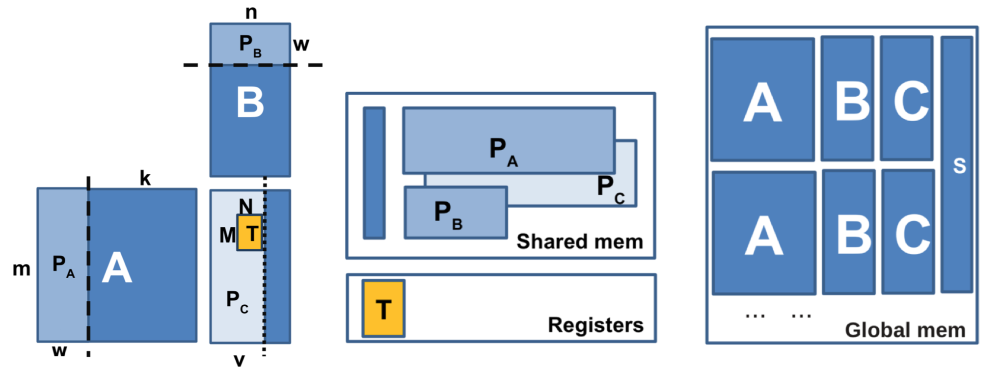

# DBCSR-data

This repository contains the data resulting from the autotuning of [libcusmm](https://github.com/cp2k/dbcsr/tree/develop/src/acc/libsmm_acc/libcusmm) kernels, that can be used as training data for the [predictive modeling of optimal parameters for libcusmm](https://github.com/cp2k/dbcsr/tree/develop/src/acc/libsmm_acc/libcusmm/predict.md).

## File Contents Description

- `baseline_performances_by_algo.json`
- `max_performances.json`
- `raw_training_data_largeDB1.csv`
- `raw_training_data_largeDB2.csv`
- `raw_training_data_medium.csv`
- `raw_training_data_small.csv`
- `raw_training_data_tiny.csv`

## To Contribute 

To gather data, follow the instruction in the [predictive modeling of optimal parameters for libcusmm](https://github.com/cp2k/dbcsr/tree/develop/src/acc/libsmm_acc/libcusmm/predict.md). 

To contribute your work, please use the [git commit template](git-commit.template).

